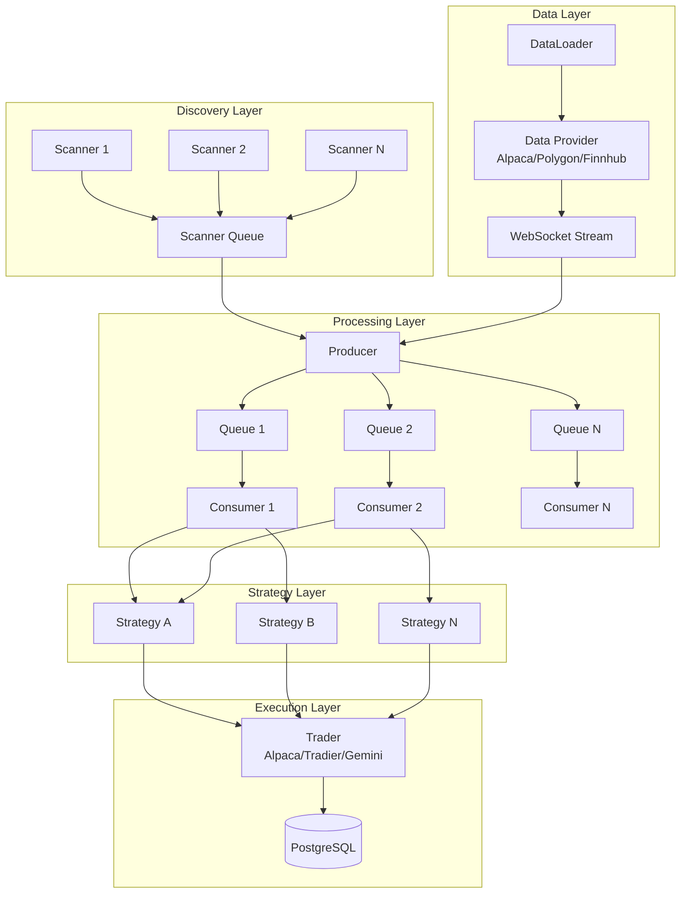
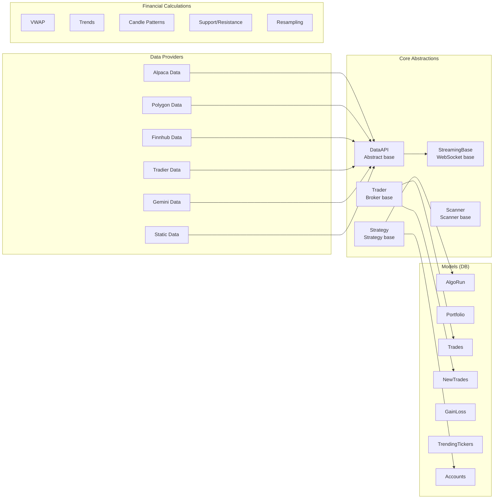

# LiuAlgoTrader -- Architecture

## System Design

LiuAlgoTrader uses a producer-consumer architecture with multiprocessing. The producer subscribes to market data and distributes events across consumer processes through queues. Each consumer independently executes strategies against incoming data.

## Trading Paradigm & Key Features

| Feature | Support | Details |
|---------|---------|---------|
| Backtesting Approach | Event-driven | Enhanced backtesting engine replays historical data through producer-consumer pipeline |
| Live Trading | Yes | Producer subscribes to real-time market data streams; consumers execute strategies and route orders to brokers |
| Paper Trading | No | No dedicated paper trading mode |
| Multi-Asset | Yes | Stocks (Alpaca, Tradier), crypto (Gemini); fractional share support |
| Data Feeds | WebSocket + REST | Real-time streaming via Alpaca/Polygon/Finnhub/Tradier/Gemini WebSocket; historical via REST APIs and DataLoader |
| ML Integration | No | No built-in ML framework; strategies can use any external ML library |
| Risk Management | Built-in | Strategy-level schedule enforcement (trading windows), position tracking, gain/loss tracking per symbol in PostgreSQL |
| Optimization | Yes | Hyperparameter optimizer for strategy tuning via backtesting/optimizer module |
| Execution | Both | Live via Alpaca/Tradier/Gemini broker APIs; simulated via enhanced backtesting engine |

## High-Level Architecture

## Component Architecture

## Key Design Patterns

### Producer-Consumer with Multiprocessing
The system spawns multiple consumer processes, each with its own event loop. The producer hashes symbols to queues, ensuring each symbol is consistently routed to the same consumer for state consistency.

### Abstract Factory for Brokers/Data
`trader_factory()` and `streaming_factory()` create broker and data provider instances based on configuration. Data sources and brokers are interchangeable without strategy changes.

### Plugin Architecture for Strategies
Strategies are loaded dynamically from file paths specified in `tradeplan.toml`. Custom strategies must inherit from `Strategy` base class and implement `run()` or `run_all()`.

### Plugin Architecture for Scanners
Scanners are similarly loaded dynamically. They inherit from `Scanner` and implement `run()` to return lists of discovered symbols.

### Database-Backed State
All trade state is persisted to PostgreSQL via asyncpg. This enables trade replay, backtesting against historical runs, and portfolio analytics.

## Data Provider Interface

All data providers implement `DataAPI`:

| Method | Description |
|--------|-------------|
| `get_symbol_data()` | Historical OHLCV data for symbol |
| `get_symbols_data()` | Batch historical data |
| `get_market_snapshot()` | Current market state |
| `get_symbols()` | List available symbols |
| `get_last_trading()` | Last trading timestamp |
| `num_trading_minutes()` | Trading minutes in range |
| `num_trading_days()` | Trading days in range |

## Broker Interface

All brokers implement `Trader`:

| Method | Description |
|--------|-------------|
| `get_position()` | Current position for symbol |
| `get_market_schedule()` | Market open/close times |
| `is_market_open()` | Check if market is currently open |
| `get_tradeable_symbols()` | List of tradeable symbols |
| `reconnect()` | Reconnect to broker |
| `create_session()` | Create new algorithm run session |

---
## See Also
- [README](README.md) — Project overview and quick start
- [Workflow](workflow.md) — Event flows and processing pipelines
- [State Management](state-management.md) — State lifecycle and data models
- [Development](development.md) — Development guide and best practices
