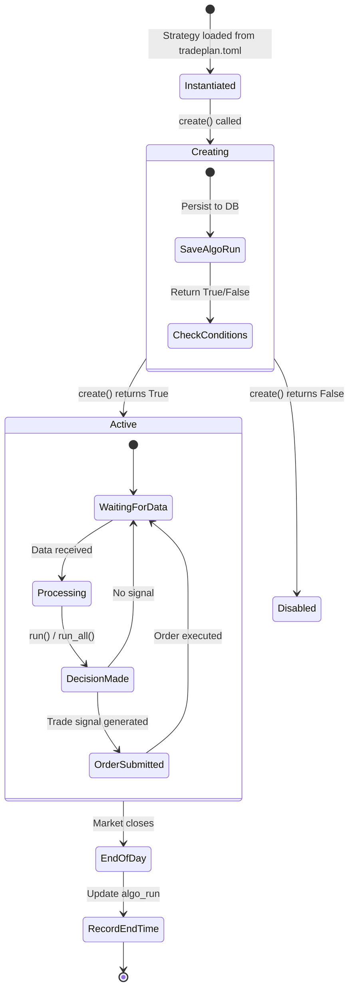
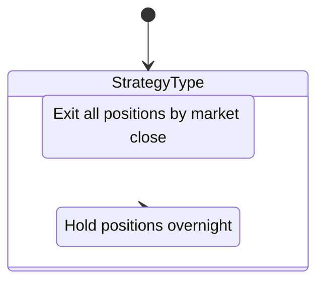
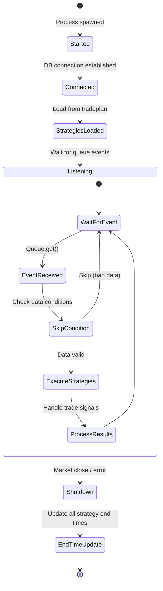
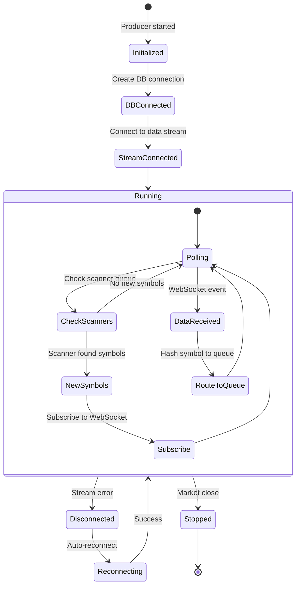
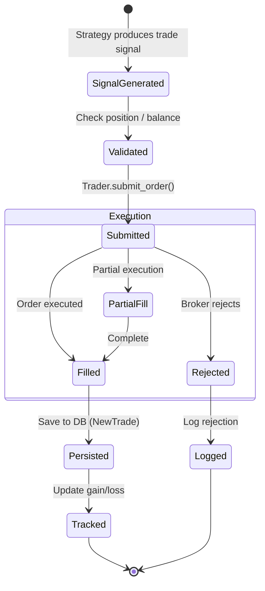
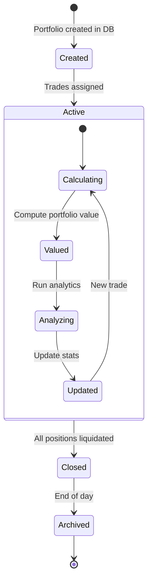

# LiuAlgoTrader -- State Management

## Strategy Lifecycle

## Strategy Types

## AlgoRun State

Each strategy execution is tracked as an `AlgoRun` in the database:

| Field | Description |
|-------|-------------|
| `algo_run_id` | Unique run identifier |
| `strategy_name` | Strategy name from tradeplan |
| `batch_id` | Batch grouping for related runs |
| `start_time` | Execution start timestamp |
| `end_time` | Execution end timestamp |
| `end_reason` | Why the run ended |
| `ref_algo_run_id` | Reference run for backtesting |

## Consumer Process State

## Producer State

## Trade State Machine

## Portfolio State

## Database Schema State

Key database tables and their relationships:

| Table | Purpose | Key Fields |
|-------|---------|-----------|
| `algo_run` | Strategy execution tracking | algo_run_id, strategy_name, batch_id |
| `new_trades` | Individual trade records | trade_id, algo_run_id, symbol, side, qty, price |
| `trending_tickers` | Scanner-discovered symbols | batch_id, symbol, timestamp |
| `portfolio` | Portfolio definitions | portfolio_id, external_account_id |
| `accounts` | Account balances | account_id, balance |
| `gain_loss` | Profit/loss tracking | symbol, gain_loss, algo_run_id |
| `ticker_data` | Symbol metadata | symbol, data |
| `optimizer` | Optimization results | parameters, performance |

---
## See Also
- [README](README.md) — Project overview and quick start
- [Architecture](architecture.md) — System design and components
- [Workflow](workflow.md) — Event flows and processing pipelines
- [Development](development.md) — Development guide and best practices
