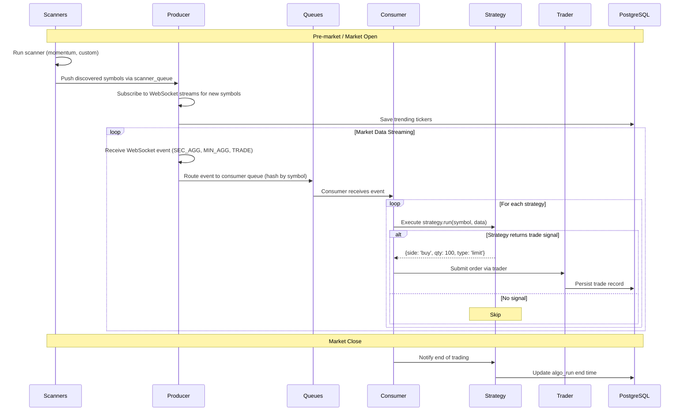
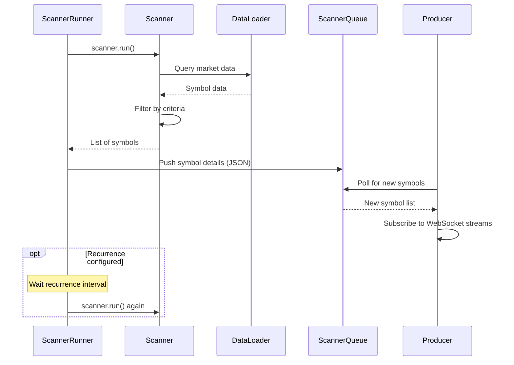
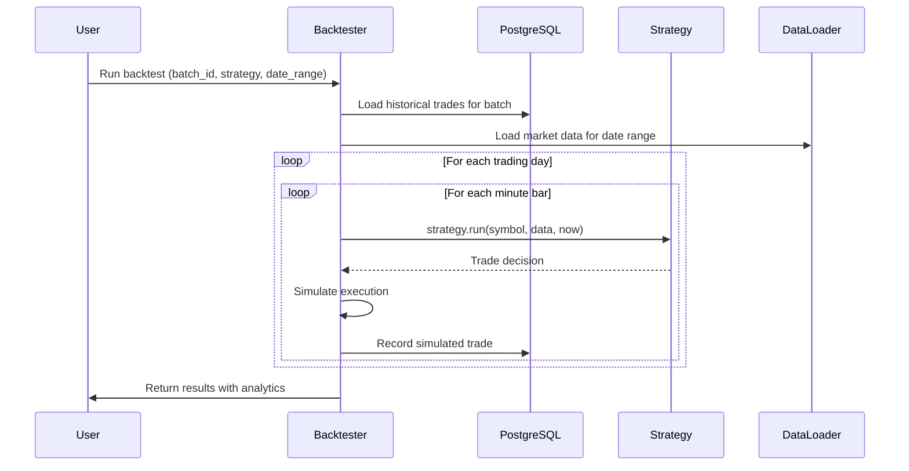
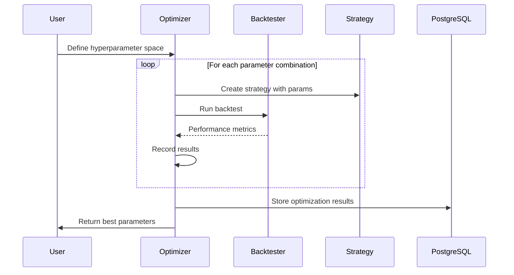
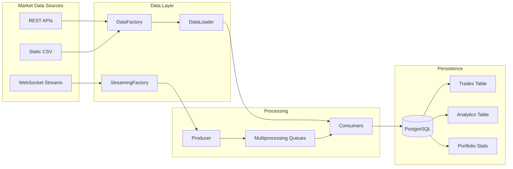

# LiuAlgoTrader -- Workflow

## Trading Day Workflow



## Scanner Iteration Flow



## Backtesting Workflow



## Strategy Execution Modes

```mermaid
graph TB
    subgraph "run() Mode - Per Symbol"
        R1[Receive data for single symbol]
        R2[Apply strategy logic]
        R3[Return trade decision]
        R1 --> R2 --> R3
    end

    subgraph "run_all() Mode - Portfolio"
        RA1[Receive all symbol positions]
        RA2[Cross-symbol analysis]
        RA3[Return portfolio-wide decisions]
        RA1 --> RA2 --> RA3
    end

    C[Consumer] --> |should_run_all() = False| R1
    C --> |should_run_all() = True| RA1
```

## Optimization Workflow



## Data Flow Architecture



---
## See Also
- [README](README.md) — Project overview and quick start
- [Architecture](architecture.md) — System design and components
- [State Management](state-management.md) — State lifecycle and data models
- [Development](development.md) — Development guide and best practices
